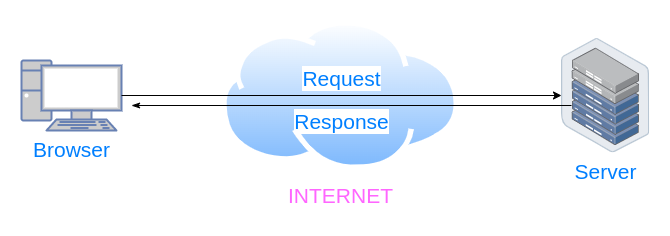
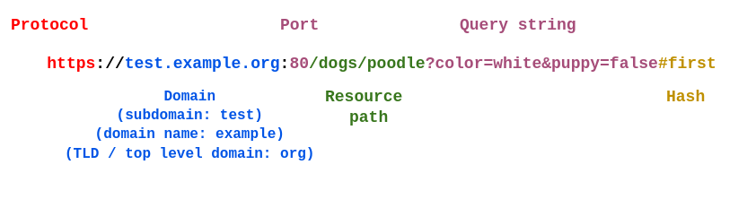

# Internet und Netzwerkkonzept/ Chatgpt, Montag 01.07.2024

- Was werden wir heute lernen :

1. `Anatomie von URLs`

- Uniform Resource Locator; eine Webadresse

- Viele Kommunikationen über das Internet verwenden URLs

eine Webadresse in deinen Browser eingibst?

- Dein Browser sendet eine GET-Anfrage

- Ein Server verarbeitet die Anfrage und sendet eine Antwort zurück

- Du hast immer einen Client und einen Server

- Diese Art der Kommunikation basiert auf dem HTTP-Protokoll

- Protokoll = Satz von Regeln

- Dein Computer antwortet immer auf die Domain "localhost"

- Wenn du einen lokalen Webserver hast, könnte es http://localhost:80 sein

- Der ursprüngliche Port für HTTP war 80

- Einige gängige Alternativen sind 8080, 9000 und 3000

- Für HTTPS ist der Port normalerweise 443

- 25 für SMTP (Simple Main Transfer Protocol), eines der E-Mail-Protokolle

- 

- 

2. `HTTP, HTTPS`

- Also; HTTP ist "Hypertext Transfer Protocol"

  - Wieder; Protokoll = Satz von Regeln
  - HTTP = Satz von Regeln, wie Clients und Server Informationen austauschen
  - Wir werden später im Kurs mehr über diese Regeln lernen

  - HTTPS ist HTTP, aber mit Verschlüsselung
  - Es war früher SSL, jetzt ist es üblicherweise TLS

  - Wenn eine HTTPS-Anfrage und Antwort passiert
  - Der Client und der Server machen einen "Handshake"
  - Sie lernen sich kennen und wählen eine geheime Sprache
  - Der Client kann dann eine verschlüsselte Anfrage mit der geheimen Sprache machen
  - Der Server wird es verstehen und eine verschlüsselte Antwort senden!

3. `IP-Adressen`

- Alles, was mit dem Internet verbunden ist, hat eine technische Adresse

- IP = Internetprotokoll

- Es gibt zwei Arten von IP-Adressen, IPv4 und IPv6

- Dein Computer kann sich immer mit `127.0.0.1` beziehen

- IPv4-Adressen haben 4 Zahlen, die durch Punkte getrennt sind

  - Die Zahlen gehen von 0 bis 255

  - IPv6-Adressen sind etwas komplexer, wie zum Beispiel
  - `2a02:810a:8c0:398c::b7f0`

4. `DNS`

- Was ist DNS?

  - Domain Name System

  - Eine Domain ist eine menschenlesbare und leichter zu merkende Webadresse

  - Anstatt http://172.217.16.78
  - Kannst du http://google.com machen

5. `Chatgpt`

## Resources:

- [What is a URL](https://developer.mozilla.org/en-US/docs/Learn/Common_questions/Web_mechanics/What_is_a_URL)

- [HTTP vs HTTPS](https://www.cloudflare.com/de-de/learning/ssl/why-is-http-not-secure/)

- [IP Adresse](https://www.youtube.com/watch?v=yvyAQiiKIN8)

## Selbst lernen:

- Was ist ein VPN und wie funktioniert ?
